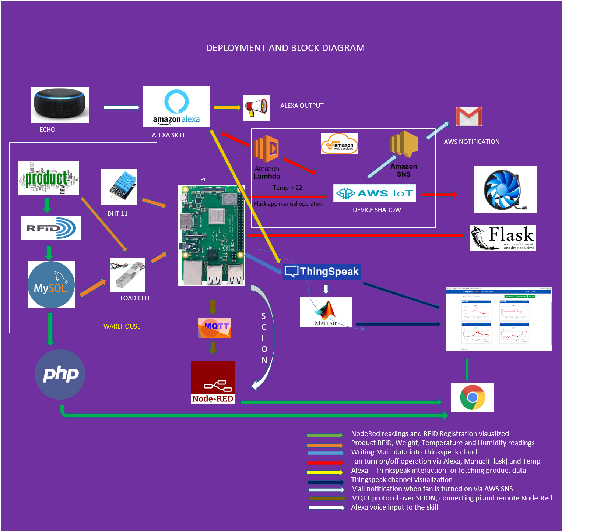

#### IoT-driven-Smart-Inventory-management-using-SCION-protocol-Integration-with-Alexa-AWS-and-Thingspeak

There are several Internet of things (IoT) applications running on legacy networks which are not flexible in terms of path selections, network outages and security concerns. Thus, the current situation demands switching over to a new network platform which is highly scalable, secure, and isolated in terms of its architecture. Thus, an IoT application is being attempted which will use <a href="https://www.scion-architecture.net">Scalable Control and Isolation on Next generation networks </a> (SCION) architecture and hence, surpasses the existing concerns on the current network protocols. The chosen Internet of things (IoT) application is based on Inventory Management wherein immediate actions like stock replenishment or availing discounts can be provided based on the monitored weights of the articles available for sale. The implementation follows a simple client server architecture in SCION wherein one autonomous system (AS) acts as the client and the other autonomous system (AS) acts as the server. The Autonomous systems are integrated with vivid range of cloud service providers like AWS and Thingspeak. We have also integrated our project with Alexa and AWS Lambda as an enhancement.

## BLOCK AND DEPLOYMENT DIAGRAM

